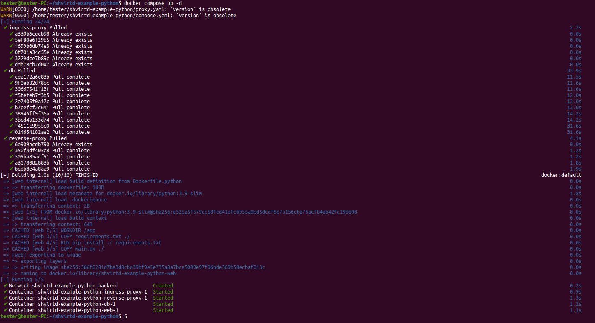

# Домашнее задание к занятию «Практическое применение Docker»

https://github.com/netology-code/virtd-homeworks/blob/shvirtd-1/05-virt-04-docker-in-practice/

---
## Примечание: Ознакомьтесь со схемой виртуального стенда [по ссылке](https://github.com/netology-code/shvirtd-example-python/blob/main/schema.pdf)

---
## Задача 0
1. Убедитесь что у вас НЕ(!) установлен ```docker-compose```, для этого получите следующую ошибку от команды ```docker-compose --version```
```
Command 'docker-compose' not found, but can be installed with:

sudo snap install docker          # version 24.0.5, or
sudo apt  install docker-compose  # version 1.25.0-1

See 'snap info docker' for additional versions.
```
В случае наличия установленного в системе ```docker-compose``` - удалите его.  
2. Убедитесь что у вас УСТАНОВЛЕН ```docker compose```(без тире) версии не менее v2.24.X, для это выполните команду ```docker compose version```  

## Решение 0


---
## Задача 1
1. Сделайте в своем github пространстве fork [репозитория](https://github.com/netology-code/shvirtd-example-python/blob/main/README.md).
   Примечание: В связи с доработкой кода python приложения. Если вы уверены что задание выполнено вами верно, а код python приложения работает с ошибкой то используйте вместо main.py файл not_tested_main.py(просто измените CMD)
3. Создайте файл с именем ```Dockerfile.python``` для сборки данного проекта(для 3 задания изучите https://docs.docker.com/compose/compose-file/build/ ). Используйте базовый образ ```python:3.9-slim```. 
Обязательно используйте конструкцию ```COPY . .``` в Dockerfile. Не забудьте исключить ненужные в имадже файлы с помощью dockerignore. Протестируйте корректность сборки.  
4. (Необязательная часть, *) Изучите инструкцию в проекте и запустите web-приложение без использования docker в venv. (Mysql БД можно запустить в docker run).
5. (Необязательная часть, *) По образцу предоставленного python кода внесите в него исправление для управления названием используемой таблицы через ENV переменную.

### ВНИМАНИЕ!
!!! В процессе последующего выполнения ДЗ НЕ изменяйте содержимое файлов в fork-репозитории! Ваша задача ДОБАВИТЬ 5 файлов: ```Dockerfile.python```, ```compose.yaml```, ```.gitignore```, ```.dockerignore```,```bash-скрипт```. Если вам понадобилось внести иные изменения в проект - вы что-то делаете неверно!

## Решение 1

Создаём файл [Dockerfile.python](./shvirtd-example-python-main/Dockerfile.python)

```
FROM python:3.9-slim
WORKDIR /app
COPY requirements.txt ./
RUN pip install -r requirements.txt
COPY main.py ./
CMD ["python", "main.py"]
```

Тестируме корректность сборки
```docker build -t my_image_python_in_docker -f Dockerfile.python .```


---
## Задача 2 (*)
1. Создайте в yandex cloud container registry с именем "test" с помощью "yc tool" . [Инструкция](https://cloud.yandex.ru/ru/docs/container-registry/quickstart/?from=int-console-help)
2. Настройте аутентификацию вашего локального docker в yandex container registry.
3. Соберите и залейте в него образ с python приложением из задания №1.
4. Просканируйте образ на уязвимости.
5. В качестве ответа приложите отчет сканирования.

---
## Задача 3
1. Изучите файл "proxy.yaml"
2. Создайте в репозитории с проектом файл ```compose.yaml```. С помощью директивы "include" подключите к нему файл "proxy.yaml".
3. Опишите в файле ```compose.yaml``` следующие сервисы: 

- ```web```. Образ приложения должен ИЛИ собираться при запуске compose из файла ```Dockerfile.python``` ИЛИ скачиваться из yandex cloud container registry(из задание №2 со *). Контейнер должен работать в bridge-сети с названием ```backend``` и иметь фиксированный ipv4-адрес ```172.20.0.5```. Сервис должен всегда перезапускаться в случае ошибок.
Передайте необходимые ENV-переменные для подключения к Mysql базе данных по сетевому имени сервиса ```web``` 

- ```db```. image=mysql:8. Контейнер должен работать в bridge-сети с названием ```backend``` и иметь фиксированный ipv4-адрес ```172.20.0.10```. Явно перезапуск сервиса в случае ошибок. Передайте необходимые ENV-переменные для создания: пароля root пользователя, создания базы данных, пользователя и пароля для web-приложения.Обязательно используйте уже существующий .env file для назначения секретных ENV-переменных!

2. Запустите проект локально с помощью docker compose , добейтесь его стабильной работы: команда ```curl -L http://127.0.0.1:8090``` должна возвращать в качестве ответа время и локальный IP-адрес. Если сервисы не стартуют воспользуйтесь командами: ```docker ps -a ``` и ```docker logs <container_name>``` . Если вместо IP-адреса вы получаете ```NULL``` --убедитесь, что вы шлете запрос на порт ```8090```, а не 5000.

5. Подключитесь к БД mysql с помощью команды ```docker exec -ti <имя_контейнера> mysql -uroot -p<пароль root-пользователя>```(обратите внимание что между ключем -u и логином root нет пробела. это важно!!! тоже самое с паролем) . Введите последовательно команды (не забываем в конце символ ; ): ```show databases; use <имя вашей базы данных(по-умолчанию example)>; show tables; SELECT * from requests LIMIT 10;```.

6. Остановите проект. В качестве ответа приложите скриншот sql-запроса.

## Решение 3

Создаём [compose.yaml](./shvirtd-example-python-main/compose.yaml)
```
version: '3.8'
include:
  - proxy.yaml

services:

  db:
    image: mysql:8
    restart: on-failure
    env_file:
      - .env
    networks:
      backend:
        ipv4_address: 172.20.0.10

  web:
    build:
      dockerfile: Dockerfile.python
    environment:
      - DB_HOST=db
      - DB_USER=app
      - DB_NAME=virtd
      - DB_PASSWORD=QwErTy1234
    restart: on-failure
    networks:
      backend:
        ipv4_address: 172.20.0.5
```

Запускаем проект локально с помощью docker compose
```docker compose up -d```


Проверяем работу проекта через curl
```curl -L http://127.0.0.1:8090```


Подключитесь к БД mysql и проверяем её работу

```docker exec -ti shvirtd-example-python-db-1 mysql -uroot -pYtReWq4321```

```show databases; use virtd; show tables; SELECT * from requests LIMIT 10;```


---
## Задача 4
1. Запустите в Yandex Cloud ВМ (вам хватит 2 Гб Ram).
2. Подключитесь к Вм по ssh и установите docker.
3. Напишите bash-скрипт, который скачает ваш fork-репозиторий в каталог /opt и запустит проект целиком.
4. Зайдите на сайт проверки http подключений, например(или аналогичный): ```https://check-host.net/check-http``` и запустите проверку вашего сервиса ```http://<внешний_IP-адрес_вашей_ВМ>:8090```. Таким образом трафик будет направлен в ingress-proxy. ПРИМЕЧАНИЕ:  приложение main.py( в отличие от not_tested_main.py) весьма вероятно упадет под нагрузкой, но успеет обработать часть запросов - этого достаточно. Обновленная версия (main.py) не прошла достаточного тестирования временем, но должна справиться с нагрузкой.
5. (Необязательная часть) Дополнительно настройте remote ssh context к вашему серверу. Отобразите список контекстов и результат удаленного выполнения ```docker ps -a```
6. В качестве ответа повторите  sql-запрос и приложите скриншот с данного сервера, bash-скрипт и ссылку на fork-репозиторий.

## Решение 4

Устанавливаем docker
```
https://docs.docker.com/engine/install/ubuntu/
curl -fsSL https://test.docker.com -o test-docker.sh
sudo sh test-docker.sh
sudo usermod -aG docker tester
sudo systemctl restart docker # and reconnect

https://docs.docker.com/compose/install/linux/
sudo apt-get install docker-compose-plugin
```

Пишем скрипт для запуска приложения и запускаем
```
#sudo apt install -y git
sudo git clone https://github.com/Spardoks/shvirtd-example-python.git /opt/shvirtd-example-python
cd /opt/shvirtd-example-python
docker compose up -d
```

Посылаем запросы с https://check-host.net/check-http и проверяем БД (посылаем сюда http://51.250.71.206:8090)


---
## Задача 5 (*)
1. Напишите и задеплойте на вашу облачную ВМ bash скрипт, который произведет резервное копирование БД mysql в директорию "/opt/backup" с помощью запуска в сети "backend" контейнера из образа ```schnitzler/mysqldump``` при помощи ```docker run ...``` команды. Подсказка: "документация образа."
2. Протестируйте ручной запуск
3. Настройте выполнение скрипта раз в 1 минуту через cron, crontab или systemctl timer. Придумайте способ не светить логин/пароль в git!!
4. Предоставьте скрипт, cron-task и скриншот с несколькими резервными копиями в "/opt/backup"

---
## Задача 6

Скачайте docker образ ```hashicorp/terraform:latest``` и скопируйте бинарный файл ```/bin/terraform``` на свою локальную машину, используя dive и docker save.
Предоставьте скриншоты  действий .

## Решение 6

```
sudo snap install dive # or https://github.com/wagoodman/dive
docker pull hashicorp/terraform:latest
dive hashicorp/terraform:latest
```


```
docker image save -o terraform.tar hashicorp/terraform:latest
mkdir terraform_image
cd terraform_image
tar -xf ../terraform.tar
cd blobs/sha256
tar -xf ./d3e69724fc31cf432dc3afb4566ecc679bc485aafd70177895611a071982aaf8
cd bin
```


---
## Задача 6.1
Добейтесь аналогичного результата, используя docker cp.  
Предоставьте скриншоты  действий .

## Решение 6.1

```
docker create --name terraform-container hashicorp/terraform:latest /bin/bash
docker cp terraform-container:/bin/terraform ./terraform
```


---
## Задача 6.2 (**)
Предложите способ извлечь файл из контейнера, используя только команду docker build и любой Dockerfile.  
Предоставьте скриншоты  действий .

---
## Задача 7 (***)
Запустите ваше python-приложение с помощью runC, не используя docker или containerd.  
Предоставьте скриншоты  действий .